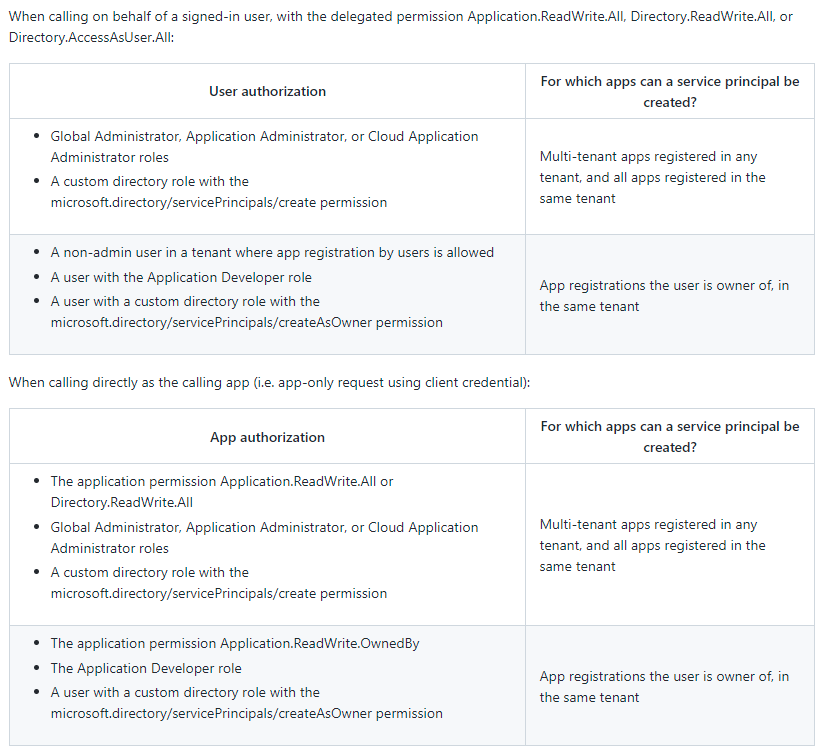
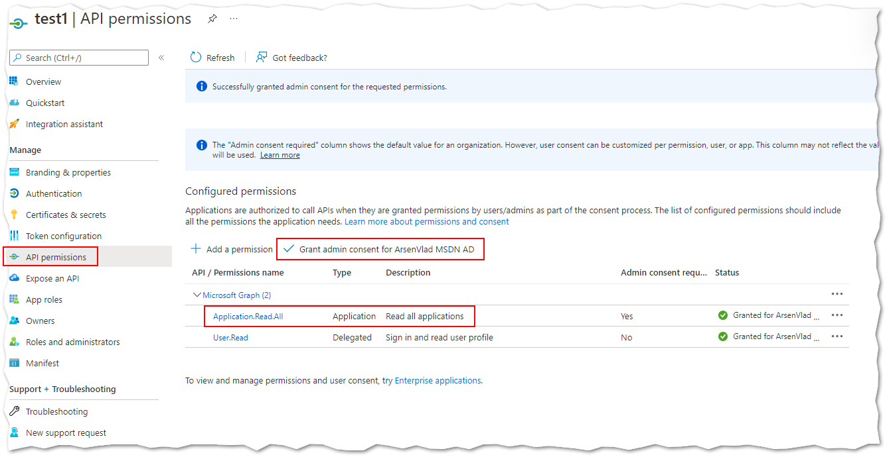

# Azure AD least-privilege permission for creating service principal from a multi-tenant application registration in another Azure AD tenant

In this sample, we look at what is the least-privilege permission or Azure AD role that an app identity needs to be able to create a Service Principal from a multi-tenant application registration in another Azure AD tenant. By least-privilege we mean that we don't want our app identity to have the `Application Administrator` or `Cloud Application Administrator` roles at the scope of the full directory and don't want it to be able to delete or update service principals.

An example scenario for this requirement is a Continuous Integration (CI) testing automation workload that needs to create Service Principals from another Azure AD tenant programmatically - but we don't want this CI app identity to have full application admin access.

Currently in July 2022, Microsoft Graph REST API document [Create servicePrincipals](https://docs.microsoft.com/graph/api/serviceprincipal-post-serviceprincipals?view=graph-rest-1.0&tabs=http) says that in order to create cross-tenant service principals the app identity must be assigned `Cloud Application Administrator` or `Application Administrator` role. However, there is an open [GitHub issue](https://github.com/microsoftgraph/microsoft-graph-docs/issues/16138#issuecomment-1158861560) that provides more details about corrections that need to be made to that document:



As we can see from the table above, the only least-privilege option we have is to give our app identity a [custom Azure Active Directory role](https://docs.microsoft.com/azure/active-directory/roles/custom-create) that includes the `microsoft.directory/servicePrincipals/create` permission ([full list of app permissions](https://docs.microsoft.com/azure/active-directory/roles/custom-enterprise-app-permissions#full-list-of-permissions)). Note that to be able to create custom roles in Azure AD, we need to have **Azure AD Premium P1 or P2** licenses.

We cannot use the `Application.ReadWrite.OwnedBy` app permission because it is **not** sufficient to be able to create service principals from app registrations in **another** Azure AD tenant.

## Experiment

Below are steps for a quick experiment to validate that app identity with Azure AD custom role that includes only the `microsoft.directory/servicePrincipals/create` can successfully create cross-tenant service principals, but cannot read or delete the created principal.

Create our app identity that we will experiment with (https://docs.microsoft.com/azure/active-directory/develop/howto-create-service-principal-portal)

Create the custom role in Azure AD (https://docs.microsoft.com/en-us/azure/active-directory/roles/custom-create)

```bash
az rest --method POST --url https://graph.microsoft.com/v1.0/roleManagement/directory/roleDefinitions --body '@aad-custom-role-sp-creator.json' -o json
```

Assign the custom role to our app identity (https://docs.microsoft.com/en-us/azure/active-directory/roles/custom-create#assign-a-custom-role-scoped-to-a-resource)

```bash
az rest --method POST --url https://graph.microsoft.com/v1.0/roleManagement/directory/roleAssignments --body "{\"principalId\": \"OUR_SERVICE_PRINCIPAL_OBJECT_ID\",\"roleDefinitionId\": \"ID_OF_THE_ROLE_CREATED_ABOVE\", \"directoryScopeId\": \"/\"}"
```

Login using our app identity

```bash
az login --service-principal -u OUR_APPLICATION_ID --password '' --tenant dd74924a-88ce-421a-ac87-00fc9dbe4baf --allow-no-subscriptions
```

Create service principal from a multi-tenant application registration (e.g., 9938aa28-a37e-4ba3-8eb5-43228ce62080) in another tenant

```bash
az rest --method POST --url https://graph.microsoft.com/v1.0/servicePrincipals --headers Content-type=application/json --body "{\"appId\": \"MULTITENANT_APP_ID\"}" -o json
```

Try reading the service principal information, which should fail since our app identity does don't have read permissions

```bash
az rest --method GET --url https://graph.microsoft.com/v1.0/servicePrincipals/SERVICE_PRINCIPAL_ID -o json
```

To be able to read the cross-tenant service principals that our workload creates, we would also need to give it the `Application.Read.All` app permission or additional custom role  permission like `microsoft.directory/servicePrincipals/allProperties/read`. This would enable our workload identity to read properties of **all** service principals.



> Note that when making changes to permissions of an already existing app identity you would need to re-login and wait some time for the cache to refresh and new permissions to apply. I saw it take up to 1 hour. Therefore, while experimenting, instead of making a change and waiting, it could be faster to create a new app identity and to use it instead.

After we are done with the experiments, delete the objects created above: our test service principal, custom role, and the multi-tenant service principal.